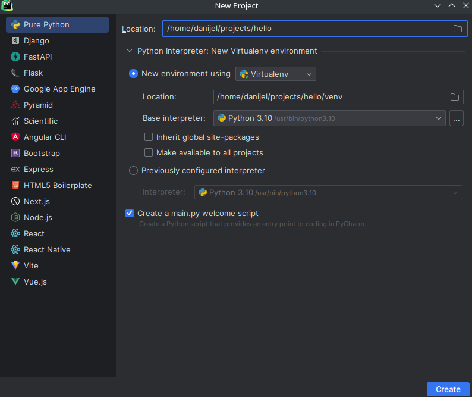

# PyCharm

## Instalacija

Za instalaciju `PyCharm`-a neophodno je instalirati [`Toolbox`](https://www.jetbrains.com/toolbox-app/) alat koji
omogućava jednostavan način za instalaciju i ažuriranje `JetBrains`-ovih alata. Pomoću `Toolbox`-a potrebno je
instalirati:

- `PyCharm Community` ili,
- `PyCharm Professional` (zahteva podešavanje licence korišćenjem `uns.ac.rs` naloga).

## Podešavanje virtualnog orkuženja

`PyCharm` ima ugrađenu podršku za `virtualenv` alat. Da bi se kreirao novi projekat u virtualnom okruženju neophondo je:

- Pod `New environment using` sekcijom neophodno je selektovati `Virtualenv` opciju.
- Pod `Base interpreter` sekcijom neophodno je odabrati željenu verziju `python` interpretera koji će se koristi u
  projektu.
- Vrednost `Location` polja nije potrebno podešavati jer razvojno okruženje automatski menja u skladu sa putanjom i
  nazivom projekta.
- Kliknuti na dugme `Create` radi kreiranje projekta.

### Napomena

U slučaju da se prilikom razvoja projekta ne koristi `PyCharm`, pogledati [upusto](03-alati.md#virtualenv) za rad
sa `virutalenv` alatom.