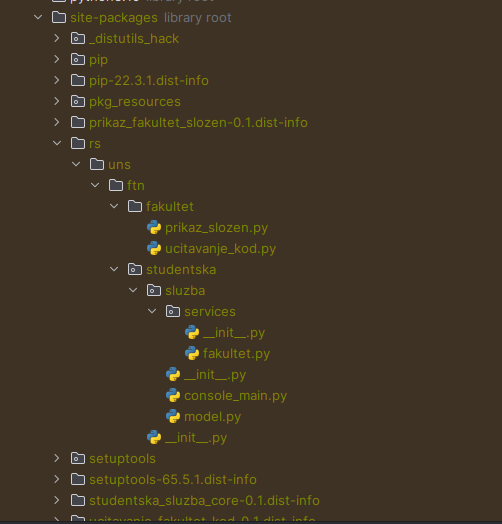
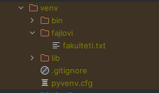

# Upustvo

Svaki Python projekat (modul) treba da ima definisan `pyproject.toml` fajl u kojem su definisani osnove
informacije o samom paketu, instrukcije za njegovu instalaciju od strane package manager-a, kao i nacin
za njegovo pokretanje ukoliko je u pitanju *binary* odnosno izvršiva datoteka (skripta, program, itd.).

Ranije se za konfiguraciju koristio `setup.py` ali se usvajanjem **PEP 517** and **PEP 518** podstiče
korišćenje `pyproject.toml` radi lakseg korišćenja i fleksibilnosit prilikom rada sa modulima.

Postoje razčiti alati za *build*-ovanje modula (*setuptools*, *poetry*, *flit*) koji se mogu izkonfigurisati
u `pyproject.toml` fajlu. U ovim primerima se koristi *setuptools*.

U ovom primeru koriste se `pkg_resources` modul za implementaciju i prepoznavanje *plugin*-a. Za ovaj primer neophodni
su instalirani `pip` i `setuptools` alati. Intaliranje *plugin*-a ili update plugin-a se vrši komandom:


## Priprema virtualnog okruženja

Preporucljivo je da se instaliranje vrši u posebnom virtuelnom okruzenju.
Da bi mogli da koristite `pip` komandu mozete instalirati po uputstvu
sa [sajta](https://pip.pypa.io/en/stable/installing/).

Zatim treba instalirati virtualenv alat komandom:

```shell
pip install virtualenv
```

Kreirati novo virtuelno okruzenje koristeci komandu:

```shell
virtualenv NAZIV_OKRUZENJA
```

Kreirano virtuelno okruzenje mozete aktivirati komandom:

### Linux

```shell
source NAZIV_OKRUZENJA/bin/activate
```

### Windows

```shell
NAZIV_OKRUZENJA\Scripts\activate
```

Da bi se ovaj primer mogao pokrenuti potrebno je postaviti putanju do python interpretera virtuelnog okruzenja u PyCharm
razvojnom okruženju tako što se ode na`File -> Settings` pronaći prikaz  `Project:Vezbe7->Project Interpreter` i otići
na `settings` dugme i izabrati opciju  `Add...`, u prozoru koji se otvori, sa leve strane izabrati
opciju `Virtualenv Environment`, a sa desne strane izabrati opciju `Existing Environment` i pronaći putanju gde je
kreirano virtuelno okruženje i izabrati python interpreter:

### Linux

```shell
NAZIV_OKRUZENJA/bin/python
```

### Windows

```shell
NAZIV_OKRUZENJA\Scrpits\python.exe
```

Ovi primeri se mogu pokrenuti iz PyCharm razvojnog okruzenja ali potrebno je za setup.py
module napraviti posebne konfiguracije tako sto se ode na:

- `Run -> Edit configurations`.
- Napravi se nova Python konfiguracija.
- Za polje`Script:` se izabere jedan od tri `setup.py` modula.
- Za polje`Script parameters:` se upise `install`.

Takođe je potrebno deselektovati opcije:

- Add content roots to PYTHONPATH
- Add source roots to PYTHONPATH

Ovo treba ponoviti za sve setup skripte koje se nalaze u projektu.

## Priprema okruženja koristeći PyCharm

- Settings -> Python Interpreter -> Add new Interpreter -> Add local interpreter
- Za `Path` podesiti `<pwd>/sok/07-setuptools/StudentskaSluzbaComponent/.venv`

## Instalacija komponenti

Instalacija komponente se radi pomoću:

```shell
pip install <plugin_path>
```

Deinstalacija komponente se radi pomoću:

```shell
pip uninstall <plugin_name>
```

Instalacija svih komponenti i ujedno podešavanje samog projekta:

```shell
pip install \
  ./Core \
  ./FakultetUcitavanjeKod/ \
  ./FakultetPrikazObican/ \
  ./FakultetPrikazSlozen/ \
  ./FakultetUcitavanjeFajl/
sluzba_main
```

Korišćenjem `pip install <plugin_path>` se modul dodaje u `site-packages` i pritom se formira odgovarajuca hijerarhija
modula u skladu sa definisanim *namespace*-ovima:



Neophodno je obratiti paznju na `data_files` sekciju u odnosu na nacin instlacije. Ukoliko se instalacija radi
preko `pip`, fajlovi se dodaju `/venv` folderu:

`data_files=[('fajlovi', ['fajlovi/fakulteti.txt'])],`



i moguće im je pristupiti preko `os.path.join(sys.prefix, 'fajlovi/fakulteti.txt')`.


Objašnjenje `StudentskaSluzbaComponent/Core/pyproject.toml` fajla:

```toml
[build-system]
# Definiše se konfiguracija samog alata za build-ovanje projekta Specifies the build dependencies: setuptools and wheel are required to build the project.
requires = ["setuptools>=42", "wheel"] # alati koji se koriste za build-ovanje projekta i njehove zavisnosti
build-backend = "setuptools.build_meta"  # koristi setuptools kao build-ovanje projekta

[project]
# naziv komponente prilikom instaliranja
name = "studentska-sluzba-core"
# verzija komponente
version = "0.1"
# opis projekta
description = "Komponenta za studentsku službu."
# zavisnosti modula
dependencies = []

[project.optional-dependencies]
# Opcione zavisnosti, npr. alati koje se koristi za pisanje testova
test = []

[project.entry-points."console_scripts"]
# Definiše ulazne tacke u nasem modulu.
# Ova komponenta se korista kao skripta iz konzole (terminala),
# te pripada grupi `console_scripts`.
# Ovoj komponenti dodeljujemo alias `sluzba_main` kojim mozemo pozvati
# rs.uns.ftn.studentska.sluzba.console_main:main funckije iz CLI-a
# upotrebno alias (tj. $ sluzba_main)
sluzba_main = "rs.uns.ftn.studentska.sluzba.console_main:main"

[tool.setuptools.packages.find]
# Definišu koji fajlovi modula će biti deo paketa za distribuciju, odnosno
# ovi fajlvovi će biti prisutni prilikom instalacije ovog modula. 
# Treba voditi računa o veličini paketa i samo neophodne fajlove isporičivati
# tako da sve neophodne fajlove treba izfiltrirati (testovi, konfiguracioni
# fajlove za build alate itd.)

# U konkretnom slučaju želimo da obuhvatimo sve python fajlove i da očuvamo
# njihovu strukturu definisana pomoću `rs`, `uns` i `ftn` paketa, tako da se ista ta
# struktura može koristiti i od strane drugih komponenti. 
# Odnosno `rs`, `uns` i `ftn` treba definisati kao namepsace-ove tako sto se
# u `__init__.py` ova tri paketa definiše poziv declare_namespace() funkcije.

# Ova sekcija se ne mora konfigurisati ukoliko prati
# src-layout ili flat-layout strukturu jer setuptools po default-u automatski 
# prepoznaje te strukture fajlova i automatsku detekciju namespace-ova.
# Dokumentacija: https://setuptools.pypa.io/en/latest/userguide/package_discovery.html#automatic-discovery

# Ukoliko struktura fajlova nije ispoštovana može se definisati pomoću naredhih sekcija
where = ["."] # lista fajlova ili direktorijuma koji treba da budu deo paketa za distribuciju
namespaces = true # automatski detektuje namespace-ove

[tool.setuptools]
# Sta ova distribucija (komponenta) nudi ostalim komponentama na koriscenje.
# Ovim radimo export za apstraktne servise kao što su FakultetPrikazBase i FakultetUcitavanjeBase.
# Ovo su samo dodatni metapodaci o samom paketu radi bolje dokumentacije. I dalje se kod može iz
# modula može koristiti.
provides = ["rs.uns.ftn.studentska.sluzba.services"]
```

Objašnjenje `StudenskaSluzbaKomponent/FakultetUcitavanjeFajl/pyproject.toml` fajla:

```toml
[build-system]
requires = ["setuptools>=42", "wheel"]
build-backend = "setuptools.build_meta"

[project]
name = "ucitavanje-fakultet-fajl"
version = "0.1"
description = "Komponenta za ucitavanje fakulteta iz fajla."
dependencies = []

[project.entry-points."fakultet.ucitavanje"]
ucitavanje_fajl = "rs.uns.ftn.fakultet.ucitavanje_fajl:FakultetUcitavanjeFajl"

[tool.setuptools]
provides = ["rs.uns.ftn.fakultet.ucitavanje_fajl"]

# Ova komponenta ne poštuje ni src-layout ni flat-layout strukturu
# pa se mora dodatno konfigurisati gde se nalaze python fajlovi
[tool.setuptools.packages.find]
where = ["rs"] # u `rs` paketu se nalaze python fajlovi

[tool.setuptools.data-files]
# Propratni fajlovi koje treba instalirati zajedno sa distribucijom paketa.
fajlovi = ["fajlovi/fakulteti.txt"]
```