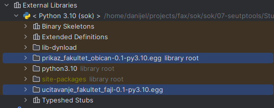
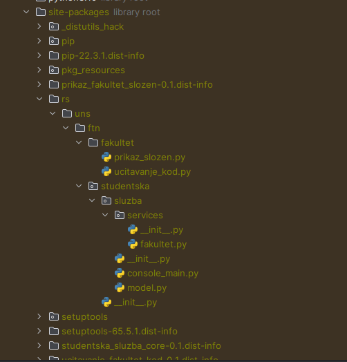

# Upustvo

U ovom primeru koriste se `pkg_resources` modul za implementaciju i prepoznavanje *plugin*-a. Za ovaj primer neophodni
su instalirani `pip` i `setuptools` alati. Intaliranje *plugin*-a ili update plugin-a se vrši komandom:

```shell
pip install <plugin_path>
```

Deinstalacija:

```shell
pip uninstall <plugin_name>
```

> **Napomena**: pogledati [razlike](#razlike-prilikom-instalacije) između prethodna načina instalacije.

Preporucljivo je da se instaliranje vrši u posebnom virtuelnom okruzenju.
Da bi mogli da koristite `pip` komandu mozete instalirati po uputstvu
sa [sajta](https://pip.pypa.io/en/stable/installing/).

Zatim treba instalirati virtualenv alat komandom:

```shell
pip install virtualenv
```

Kreirati novo virtuelno okruzenje koristeci komandu:

```shell
virtualenv NAZIV_OKRUZENJA
```

Kreirano virtuelno okruzenje mozete aktivirati komandom:

### Linux

```shell
source NAZIV_OKRUZENJA/bin/activate
```

### Windows

```shell
NAZIV_OKRUZENJA\Scripts\activate
```

Da bi se ovaj primer mogao pokrenuti potrebno je postaviti putanju do python interpretera virtuelnog okruzenja u PyCharm
razvojnom okruženju tako što se ode na`File -> Settings` pronaći prikaz  `Project:Vezbe7->Project Interpreter` i otići
na `settings` dugme i izabrati opciju  `Add...`, u prozoru koji se otvori, sa leve strane izabrati
opciju `Virtualenv Environment`, a sa desne strane izabrati opciju `Existing Environment` i pronaći putanju gde je
kreirano virtuelno okruženje i izabrati python interpreter:

### Linux

```shell
NAZIV_OKRUZENJA/bin/python
```

### Windows

```shell
NAZIV_OKRUZENJA\Scrpits\python.exe
```

Ovi primeri se mogu pokrenuti iz PyCharm razvojnog okruzenja ali potrebno je za setup.py
module napraviti posebne konfiguracije tako sto se ode na:

- `Run -> Edit configurations`.
- Napravi se nova Python konfiguracija.
- Za polje`Script:` se izabere jedan od tri `setup.py` modula.
- Za polje`Script parameters:` se upise `install`.

Takođe je potrebno deselektovati opcije:

- Add content roots to PYTHONPATH
- Add source roots to PYTHONPATH

Ovo treba ponoviti za sve setup skripte koje se nalaze u projektu.

## Instalacija komponenti

```shell
cd StudentskaSluzbaComponent
pip install \
  ./API \
  ./Core \
  ./FakultetUcitavanjeKod/ \
  ./FakultetPrikazObican/ \
  ./FakultetPrikazSlozen/ \
  ./FakultetUcitavanjeFajl/
```

## Razlike prilikom instalacije

Korišćenjem `python setup.py install` se modul se dodaje u library root-u. Na slici je prikazano kako
su `prikaz_fakultet_obican` i `ucitavanje_fakultet_fajl` dodati u library root.



Korišćenjem `pip install <plugin_path>` se modul dodaje u `site-packages` i pritom se formira odgovarajuca hijerarhija
modula u skladu sa definisanim *namespace*-ovima:



Neophodno je obratiti paznju na `data_files` sekciju u odnosu na nacin instlacije. Ukoliko se instalacija radi
preko `pip`, fajlovi se dodaju `/venv` folderu:

`data_files=[('fajlovi', ['fajlovi/fakulteti.txt'])],`


i moguće im je pristupiti preko `os.path.join(sys.prefix, 'fajlovi/fakulteti.txt')`.

Instalaija preko `setup.py` omogućava da se pristupi fajlu relativno jer bi se fajl nalazio u 
`ucitanje_fakultet_fajl-0.1.egg/fakulteti/fakkulteti.txt'.


