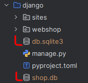

## Podesavanje projekta

Instalacija neophodnih paketa:

```shell
pip install -r requirements.txt
```

Instaliracija komponenti i plugin-a;

```shell
pip install ./api ./core ./datasource-code ./datasource-db
```

## Pokretanje Django aplikacije

```shell
cd django
python manage.py makemigrations
python manage.py migrate
python manage.py runserver
```

Obratiti pažnju da nakon interakcije sa `datasource-db` plugin-om u `django` projektu treba da se nalaze 2 baze:

- `db.slite3` - baza koju Django interno koristi,
- `shop.db` - baza koja je kreirana korisćenejem `datasource-db` plugin-a.




## Pokretanje Flask aplikacije

```shell
cd flask
flaks run
```